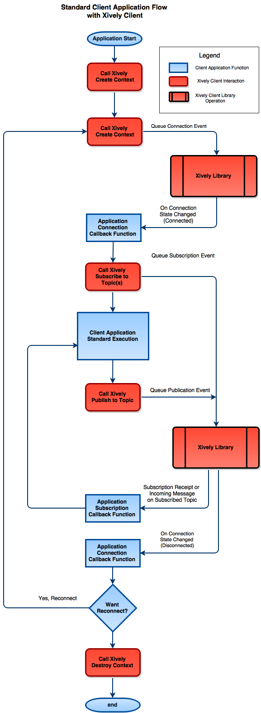

# Xively Client for C User Guide
##### Copyright (c) 2003-2018, LogMeIn, Inc.

## Hello

This document describes the intended use of the Xivley C Client by C applications attempting to connect to the Xively Service, as well as detailing the API and some of the security and communication features of the client.

This document does not provide a full source code example. However, the `examples/` directory of the [Xively C Client github repository](https://github.com/xively/xively-client-c/tree/master) includes many examples for POSIX platforms, ST, TI, and ESP32 reference boards. 

## Intended Audience

This document is meant for general readership, though the Section "Intended Flow of Client Application Usage" assume that you have some C experience and have familiarity with the build system setup for your target platform.

# Xively Client Introduction

The Xively Client is a C library which provides MQTT connectivity over TLS.  Compared to other MQTT cilents, it brings these other features to the IoT table:

### Flexibility

The client can scale capabilities to meet the needs of the platform

* It can operate on a single thread and also runs in non-blocking mode by default.
* The client does not use any CPU power when waiting for operations. Power consumption can be minimized as required.
* A thread-safe event queue and an optional thread-pool for callbacks allows the client to support robust applications and platforms beyond the standard embedded platforms.
* The Transport Layer Security (TLS) Board Support Package (BSP) can be used to leverage TLS features built into embedded platforms, or leverage software libraries like [WolfSSL](https://www.wolfssl.com) or [mbedTLS](https://tls.mbed.org/).  Please see the Platform Security Requirements for more information about TLS.

### Asynchronous Pub/Sub

Through the use of [coroutines](http://en.wikipedia.org/wiki/Coroutine) this MQTT client can handle multiple publish & subscription requests concurrently while not blocking.  This allows the client to facilitate multiple on-going communications even on NoOS devices or RTOSes.  

* The library scales from high power enterprise operating systems to RTOS and NO-OS devices.
* The library can send and receive simultaneously on a single socket.
* Communication requirements of your application will not interfere with the usability of your device.

### Secure File Transfer (SFT) and Firmware Updates (FWU)

The Xively C Client comes pre-built with functionality to communicate with the [Xively SFT Service](https://developer.xively.com/v1.0/docs/how-to-securely-transfer-files-to-my-devices).  

* Devices can be easily updated in the field with new firmware and support files.
* Data is downloaded in the background, no need to create a second connection to a new service.
* Download and update status is reported by the Xively C Client to the SFT service automatically, helping you to monitor the progress of a software deployment across your fleet of devices.

For more information SFT, please see the **Xively Client Standard Features** section below.

### Distributed Denial of Service Prevention

The Xively Client Back-Off system provides intelligent networking behavior to prevent fleets of devices from causing unintentional DDoS attacks on Xively services.

* Prevents individual clients from attempting reconnections in a tight-loop.
* Client Application is informed of pending connection attempts, disconnects, and Back-Off status changes.
* Behavior is configurable per platform to ensure that you may create the best user experience.

### Abstracted Implementation

The Xively Client was written with the understanding that the IoT Field might change over time.

* The Xively Client is written in C and can be easily ported to support custom network stacks, operating systems, toolchains and TLS implementations.
* Our Protocol Module uses MQTT for client/broker communications, with the ability to easily support new IoT protocols in the future.

### Xively Client Footprint

Currently the optimized client storage footprint requirements are about 30kb for embedded devices with optimized toolchains, not including TLS functionality.  This footprint includes a TLS certificate for validating the Xively server during TLS, 3 backup certificates for use if the main certificate becomes compromised, an event dispatcher and scheduler, the connection backoff system, and the library's platform networking, time, random number generator and memory implementations.  This footprint does not include a TLS implementation, but if one exists on the platform already, then the size requirements are negligible.

# Platform Security Requirements

The Xively Client uses TLSv1.2 to securely connect to the Xively Gateway and Blueprint services. But simply connecting with TLS isn't enough to be secure. Special considerations must be made to facilitate a secure connection in the embedded world. The following embedded device components must be in place on the platform for a secure TLS connection.

### True Random Number Generator

During TLS handshaking a [Cryptographic Nonce](http://en.wikipedia.org/wiki/Cryptographic_nonce) must be generated by the client embedded device. If this nonce is predictable, then the device's TLS connection may be compromised and anything that's communicated over the TLS connection can be stolen, including the MQTT Credentials that are used to connect to the Xively Service.

A True Random Number Generator is therefore of paramount importance as it ensures that the nonce created during TLS handshaking is unpredictable by an attacker.

Note: Random Number Generators seeded by the current time are not truly random, as the seed can be predicted.

### Accurate Real-time Clock

The Client-side of the TLS Handshake process includes steps to ensure that the server-provided certificate is still valid:

* A check to see if the current date is past the Certificate's Activation Date, and that the current time precedes the Certificate's Expiration Date.
* A check to see if an OCSP response has not expired.
    * You can read more about OCSP Stapling here: http://en.wikipedia.org/wiki/OCSP_stapling

Without an accurate clock these certificate activation & validation tests will be inaccurate. Even worse, if the time is substantially inaccurate (like a device that thinks it's 1970, for instance) then TLS handshaking will fail and the device will never connect to the Xively Service.

### Remote Updates

Remote Updates is a desired feature for many reasons, but when it comes to security it's extraordinarily important. Cryptographic algorithms can be exploited over time (making their use risky), protocol implementations could be found to be faulty, and Root CA Certificates (which are stored on the device might) will expire and need to be updated. Without the ability to update the device remotely there is a high risk that the Server and Client will be running different security mechanisms, causing TLS Handshaking to Fail.

The Xively Team (Xively-Sales@logmein.com) can work with you to develop a firmware update strategy for your platform.  We currently have a reference implementation for embedded devices in-house and will make this public by mid 2017. 

# TLS Implementation Requirements

The Xively Client has been tested against [WolfSSL's library v3.2.0](https://www.wolfssl.com) and [mbedTLS](https://tls.mbed.org) (formerly PolarSSL). The following guidelines will help to ensure that your TLS implementation meets the same standards if you use a different implementation. Please see our [Xively C Client Porting Guide](https://github.com/xively/xively-client-c/blob/master/doc/porting_guide.md) for building the Xively C Client's Abstracted TLS BSP to support other TLS implementations.

Note: We've found that some versions of TLS in hardware do not have all of these features.  In these cases we recommend using a software library for TLS if the platform's has the flash storage available for it.

## Xively's TLS Requirements

* Server Certificate Root CA validation
    * TLS implementation must accept a series of Root CA certificates stored on the client to determine if the Server Certificate (provided at TLS handshaking) has been signed by one of the Root CAs.
    * Requires accurate Clock

* Server Domain Checking
    * Wildcard support for domain name checks

* [Online Certificate Status Protocol (OCSP)](http://en.wikipedia.org/wiki/Online_Certificate_Status_Protocol)
    * Used to determine if a server certificate has been revoked
    * Circumvents the need for Certificate Revocation Lists on the device.
    * Requires the use of two sockets per connection, at least for the duration of TLS handshaking
    * Requires accurate clock

* [OCSP Stapling](http://en.wikipedia.org/wiki/OCSP_stapling)
    * OCSP mode that does not require a second socket
    * Requires Accurate Clock

* [Server Name Indication (SNI)](http://en.wikipedia.org/wiki/Server_Name_Indication)
    * Requirement of Xively Gateways for load balancing reasons.

* Algorithm Support for the following Root CA Public Certificates which are embedded in the Xively Client
    * VeriSign Class 3 Public Primary Certification Authority - G5_07.17.2036_RSA2048sha1.cer
    * Thawte Primary Root CA - G3_12.02.2037_RSA2048sha256.cer
    * GeoTrust Primary Certification Authority - G3_12.02.2037_RSA2048sha256.cer
    * GlobalSign Root CA - R1_01.28.2028_RSA2048sha1.cer

# Xively Client Standard Features

The Xively Client Agent for C was designed with embedded systems in mind. It has a low footprint, minimal memory usage, and a scheduling system to make your application's use of MQTT as easy as possible.  It can run on a single thread with a single socket connection on multiple operating systems.  The following details all of these subsystems and features.


### General MQTT Standard v3.1.1

[MQTT Standard v3.1.1 Reference](http://docs.oasis-open.org/mqtt/mqtt/v3.1.1/os/mqtt-v3.1.1-os.html)

The Xively Client uses MQTT formatted messages to communicate over a publish / subscribe topic structure.  In this paradigm the client connects a TCP socket to the Xively Service, and uses that socket to request subscriptions to one or many topics. Once subscribed, any information that is published to those topics from other applications or devices, or messages that are channeled to the device through Xively Blueprint permissions, will be delivered to the client application on the embedded device. Similarly, devices can publish to topics to communicate to one or many devices through the Xively Service.


With pub/sub the device can be relatively in the dark about who is actually listening.  It doesn't need to keep track of numerous connections, or maintain state of connections to multiple parties.  It doesn't have to incur the overhead of broadcasting messages to multiple addresses, either.  Instead it can simply publish to a topic and let the Xively MQTT Broker and Blueprint service worry about routing the messages from A to B.

* MQTT also supplies Quality of Service (QoS) levels:
    * With QoS Service 0, the message that is published is sent to the broker and the client doesn't know if the messages was delivered or not.
    * With QoS 1, the client will receive a 'receipt' when the message is delivered to the intended audience, though it might be delivered numerous times in order to fulfill that. This QoS level is called AT\_LEAST\_ONCE.
    * QoS 2 is like QoS 1, but the message will reach the target only once.  This level is called AT\_MOST\_ONCE.

Note:  Currently the Xively Service does not support QoS 2 level of service.

With this communication toolbox embedded devices can be used to listen and publish to particular topics, and the messages will be automatically routed to the correct devices based on the current state of topic subscriptions and permissions set within the Xively Service.  It's a nice series of features for limited devices with limited connection can use for control and data analysis.


**Message Size Limitations**

Currently the Xively Service supports a maximum message size of 128kb.


### Secure File Transfer (SFT) and Firmware Updates (FWU)

The [Xively SFT Service](https://developer.xively.com/v1.0/docs/how-to-securely-transfer-files-to-my-devices) is designed to deploy files and firmware to fleets of devices in the field. The Xively C Client has an optional SFT module (enabled by default) to coordinate with Xively SFT Service to retreive and store these files on your device. 

The Xively C Client uses the device's existing MQTT connection for SFT functionality, so there's no need to build a separate connection to another service.  And since the Xively C Client is non-blocking and asynchronous, the files are downloaded in the background without needing to change any application flow or interrupt device usability.  

In Xively SFT, the client drives the whole process, determining when to download files, how large of a chunk to fetch at a time, and when to reboot to test new firmware.  Download status and errors are automatically sent by the Xively C Client so that you can track the software deployment progress across your whole fleet via the Xively SFT Service interface.

We have chosen some suggested configurations for a default behavior, but the code can be easily customized for the best-fit of your platform and product. 

The code for the file storage and firmware update functionality is handled through the File IO and Firmware Update Board Support Package (BSP) implementations. For more information please see the [Xively C Client Porting Guide](https://github.com/xively/xively-client-c/blob/master/doc/porting_guide.md) and the functions declared in `include/bsp/xi_bsp_io_fs.h` and `include/bsp/xi_bsp_fwu.h`.  

Additionally we have a few reference implementations for POSIX and the TI CC3200 in the `src/bsp/platform/posix/` and the `src/bsp/platform/cc3200/` directories, and a [SFT Tutorial on the Xively Developer Center](https://developer.xively.com/v1.0/docs/ti-cc3200-sft-example).

### TLS Support

Currently the Xively Client for C has two working implementations of its TLSv1.2 Board Support Package (BSP) for embedded devices: WolfSSL's TLS library or mbedTLS. The Github Repository has the sources for the Xively C Client to interface with either of these implementations, but we do not directly provide the source for the TLS libraries themselves.

However, for your convenience, depending on the make configuration you execute, these implementations will be automatically checked-out of their respective github repositories, configured, and built once you confirm that you've read and accepted their distribution licenses.

Additionally, our TI CC3200 port has a build configuration to use Texas Instruments on-chip TLS solution, and our STM32 Nucleo WiFi port makes use of the on-board TLS implementation from ST Micro.  These two should be used as references on how to talk to TLS implementations built into the platform's Secure Socket Implementations.

If you have your own TLS implementation, or if one comes with your platform software, then the modularity of the Xively C Client's Networking and TLS BSPs can support your software to provide TLS connectivity to the Xively C Client.  For more information on how to write and build with a custom TLS or Networking BSP, please see the [Xively C Client Porting Guide](https://github.com/xively/xively-client-c/blob/master/doc/porting_guide.md).

### RTOS Support

The Xively Client for C was written to be adaptable to the platform that it's running on. Standard Linux versions of our application have an event loop that doesn't return from its invocation until the last context is shut down. However, this is insufficient for RTOS devices that need to yield control to the operating system or platform software to handle task switching, network processing, etc.

For RTOS support our event loop will process a small series of events before returning control back to the main platform loop. Here the main platform loop can maintain any sort of system tick tasks, and then invoke the Xively Client to process another series of events. In this way the Xively Client does not block and can handle both incoming and outgoing publications concurrently.

The design of this interaction with this target platform's OS is a coordinated with the Xively Client porting engineer and the customer's engineering team during initial porting development for each project.  For more information on these works please see the Intended Flow of Client Application Usage section.

### Back-Off

Deploying a large fleet of connected devices to the field can be a dangerous thing. If, for some reason, a Xively Service disruption occurs then there could be thousands or millions of devices attempting to connect to the Xively Service at the same time. Such a scenario would tax the Xively Service heavily and the high load would cause issues in the Service's attempt to recover from the outage.

In order to avoid these outages and to provide the best usability for our customers and their clients, the Xively C Client includes a subsystem called Back-Off. This system monitors connection state on the client, counting disconnects to errant MQTT operations and monitoring healthy connection durations.

A device that has errant behavior, or becomes disconnected from the Xively Service, will enter Back-Off mode. In this mode, connection requests will become queued and processed at a future time. The delay in fulfilling the request is based on the severity of the Back-Off that's currently in effect.

A single disconnection event may delay the device's connection attempt by only a second. Repeated cases of connection issues will increase this penalty over time, capping the penalty at around 15 minutes.

The actual value of the Back-Off connection delay is based on a standard penalty grown schedule, but some randomness is added to the delay as well. This randomness is meant to distribute connection attempts when a fleet of devices are attempting a reconnection concurrently.

Back-Off delay penalties will diminish over time and will not affect the behavior of devices that have successfully connected to the Xively Service.

### Memory Limiter

Since the Xively Client has been designed for restricted systems we must always keep an eye on memory usage.  This optional system will set threshold limits on the amount of heap memory that the Xively Client will allocate during its operations.  Memory is allocated and freed for all MQTT serialization / deserialization operations, by the TLS system, etc.  By setting this threshold you create a strict contract with the Xively Client not to exceed a certain amount of runtime heap footprint.

If operations would cause the Xively Client to allocate memory beyond the defined bounds, then the Xively Client will start to return XI_OUT_OF_MEMORY errors on direct API invocations. Or, if the memory exhaustion event occurs while processing an already operating asynchronous task (send, receive, etc), then the Xively Client will shut itself down and clean up its allocated resources.

Note: the Memory Limiter does not pre-allocate its heap. Therefore, heap monitoring software will not see an initial jump in heap usage at initialization relating to memory limiter size.  Additionally if memory is being consumed on the device by another subsystem, then heap exhaustion could still occur at the system level.  If this occurs then applications could hang on your device.

#### Memory Limiter Functions

The following functions can be invoked to interact with the memory limiter.  Note: these functions will return XI\_NOT\_SUPPORTED if the Memory Limiter was not compiled into the Xively Client that you're application is operating on:

`xi_state_t xi_set_maximum_heap_usage( const size_t max_bytes)`

This function lets you set the maximum number of bytes that the system will allocate on the heap during its runtime operations. Depending on platform library configurations and TLS implementation this may include the overhead of the TLS handshake.

This function return an error if the provided limit is less than the amount of memory currently allocated, or if it's smaller than the Xively System allocation pool (see below for details).

`xi_state_t xi_get_heap_usage( size_t* const heap_usage )`

Queries the current amount of memory allocated for Xively Client operations, including buffers for any ongoing MQTT transmissions, TLS encodings, and scheduled event handles.

### Xively System Allocation Reservations

The Xively client reserves some memory so that it can continue operations during a memory exhaustion event. This reservation allows the client to continue processing ongoing coroutines, to clean up scheduled tasks, unroll ongoing transmissions and buffers, and to shutdown sockets properly.

By default this memory space is currently set to 2kb. Invoking xi_maximum_heap_usage to 20 kb, for instance, will result a 2kb reservation for this emergency cleanup scenario, and 18kb being available for all other Xively operations that are requested by the Client Application, including creating connections, sending and receiving buffers, and TLS processing.

# Intended Flow of Client Application Usage of Xively Client

The Xively Client is an asynchronous communication tool. Client Applications must use callback functionality to monitor the state of connections and subscriptions in order to maintain a proper communication channel to the Xively Service.  The design of the Flow will be part of the Xively Client Services and Client Application Team's coordinated efforts, but there are some baseline rules that should be followed when writing applications that use the Xively Client library.

This standard flow of an application which uses the Xively Client is detailed below.  Please note that not all functions of the Xively API are covered in this section.  For a full API specification please see the Xively C Client API reference in the `doc/doxygen` directory of the [Xively C Client github repository](https://github.com/xively/xively-client-c/tree/master/).

***Note: Provisioning Your Credentials and Topics***

Before executing the Xively Client you must create Xively Client connection credentials for your application. The following credentials can be created in your account at [app.xivley.com](https://app.xively.com):

- account id
- device id
- device secret (password)
- topic name

For more information about using the Xively Platform  please see the [Xively Developer Center](https://developer.xively.com/).


<p align="center">

<br>
Standard Client Application Flow with Xively Client
</p>

## Step 1: Create Context

A Xively context represents a socket connection to the Xively Service. All pending messages, incoming mqtt messages, subscription callbacks function pointers, etc, are associated with a Xively C Client context. A context is available through a context handle. You may create numerous context handles at a time resulting in many Xively Service connections.
You can create and store a context handle yourself by calling it **xi_create_context()**. Creating the context handle itself does not connect you to the Xively Service. You will need to provide your context handle to the **xi_connect** function, described below.

## Step 2: Connect

A call to a Xively Client Connection function will enqueue an event that, once processed, will attempt a connection to the Xively Service. This event will be processed in the next iteration of the Xively Client Event Processor, and will kick off a series of operations including domain name resolution of the Xively Service, TCP/IP Socket Connection, TLS handshaking and Certificate Validation and finally MQTT Credential handshaking.

Calls to Connect may also define Last Will data. Last Will is an MQTT feature that will have the Xively Service publish a message to a topic on behalf of the client in case the client is disconnected. For more information about Last Will please see the MQTT Specification.

Note: The call to connect will not block at all, but instead it will return immediately. The connection operation will be fulfilled on subsequent calls to the Xively Client Event Processing functions described in Step 3: Process Events.

A connection request requires that your Client Application provide a callback function. This function will be invoked when a connection to the Xively Service has been established, or if the connection was unsuccessful.

The Connect Callback function will also be invoked when the Connection to the Xively Service has been lost or purposefully shutdown.  Please see Step 6: Disconnect and Shutdown below.

You can create a connection with the invocation of **xi_connect()**.

## Step 3: Process Events

The Client Application should subscribe to its topics once a connection has been established (marked by the Xively System's invocation of the Client Application's connection callback function provided in Step 2: Connect above.)

Subscription requests must include the topic name, a subscription callback function, and a QoS level.  The QoS Level is a request to the Xively Service to set the maximum QoS level of incoming messages.  That is, if you define this as QoS Level 1 then QoS level messages directed to the Xively Client will be downgraded to QoS Level 1 by the Xively Service.  This changes the memory overhead and behavior of message processing on the Client, as QoS 1 and QoS 2 messages have more memory overhead than QoS 0 messages.

The callback will be invoked when the Xively Service has acknowledged the subscription request, and when message arrives to the given topic.

Incoming messages will include the topic data as part of the payload, so you can use the same subscription callback function for multiple topics, or you can have a unique callback function for each topic that your Client Application subscribes to.

There is no functional hard limit to the number of topics you can subscribe to with a particular context.  Each subscription has some memory overhead however (topic name and function pointer.)

To enqueue a subscription request call **xi_subscribe()**.

## Step 5: Publish

Once a connection has been established the Client Application may publish messages to the Xively Service.  Messages require a topic, message and a QoS level.  Optionally, the publication could also set a retain flag which will cause any subsequent subscribers to receive the message as soon as they subscribe to the topic in the future, if they're not subscribed.

The Client Application may supply a publish callback function to the Xively Client. This callback function is optional and is meant for embedded devices to be notified once the publication has been fully sent and any buffered data on the client has been deleted.  This was designed to facilitate devices with severe memory restrictions where the device should have only a few pending publications at a time, or which would like to track the status of very large publications.  Please note that currently this callback does not identify which pending publication message has been released, so the reuse of a function pointer in multiple publications will not provide exact knowledge of which publication had been sent and freed.

To publish a message to a topic please see one of the xi_publish functions: **xi_publish()**, **xi_publish_timeseries()**, **xi_publish_data()**.

## Step 6: Disconnect and Shutdown

The Xively Client will invoke the connection callback upon a disconnection event, as stated in Step 2: Connect above. The disconnection could be the cause of numerous scenarios including loss of internet connection, the Xively Service closing the connection with the client due to errant behavior or malformed MQTT packets, or due to the Client Application requesting that the networking connection be shutdown.

If you wish to close the connection yourself, the Client Application can invoke **xi_shutdown_connection()**.  This will enqueue an event in the Xively Event System to close the socket connection to the Xively Service, invoking the Connect Callback once the connection has been fully terminated.

The Client Application can determine the type of disconnection in the Connect Callback by checking various parameters that have been provided to the Callback Function.  Please see the Connect Callback Details below for more information on how the Client Application can determine the cause of a disconnection event.

The Client Application may call Connect again immediately from within the Connect Callback if the disconnection wasn't expected. This will queue a new Connection Request just as in Step 2: Connect above.  If the Client Application closed the connection on purpose then it can retain the Xively Client Context and invoke Connect again at a later time.  Alternatively, if more memory must be freed, then the context can be cleaned-up by invoking **xi_destroy_context**.   Further memory can be freed by calling **xi_shutdown()**, but only after all contexts have been destroyed.

Please note that **xi_shutdown()** should be called sparingly, and not on every disconnection event. **xi_shutdown()** destroys the Back-Off status cache which helps guard the Xively Service from accidental Distributed Denial of Service Attacks by devices in the field.  Please see the Back-Off Section for more information about this feature.

# Standard Operation Callbacks (Connection, Subscribe, Publish and Shutdown)

The network dependent functions: connect, subscribe, publish and shutdown are all asynchronous.  While these functions return errors immediately if some simple sanity checks fail, normal operation will cause these requests to be queued in the Xively Client event system to be processed in the next iteration the Xively Client's event processor.

Therefore, in order for Client Applications to determine if the request was successful, you will need to provide a pointer to a callback function for these requests.  These callback functions are detailed below.

**Note:** For system simplification Connect, Publish and Shutdown callbacks share the same function signature, The only exception is the Subscribe callback that require more information and little bit different treatment. In some cases not all of the parameters are used or they're used differently.  Please see the details below for how these parameters should be used in each callback scenario.

## Connect Callback

The connect callback function is used to track the current state of the connection process, and monitor disconnection behavior.

### Function Signature

```
void
on_connection_state_changed( xi_context_handle_t in_context_handle, void* data, xi_state_t state )
```

### Function Parameters

**in_context_handle**

Internally used to keep track of state of the ongoing connection. This can be provided to our event system to queue new events from within your callback.

**data**

Cast this as a `xi_connection_data_t* and observe the connection_state to determine the type of connection state change.  These values could be:

* XI_CONNECTION_STATE_OPENED
    - If the connection has successfully opened and TLS handshaking has occurred.
* XI_CONNECTION_STATE_OPEN_FAILED
    - if the connect attempt has not successfully been opened.  If so then the state parameter will be set to an xi_err state to note why the connection failed.
* XI_CONNECTION_STATE_CLOSED
    - if a previously opened connection has been shutdown.  If the state parameter is XI_STATE_OK then this connection disruption was due to the client application queueing a shutdown request via xi_shutdown_connection().  Otherwise this connection was closed either to network interruption or due to the Xively Client Gateway interrupting the connection due to errant client behavior.

**state**

Used only during XI_CONNECTION_STATE_CLOSED messages, where XI_STATE_OK is set if the connection was a regularly scheduled disconnection request made by the Client Application.  Other state values passed to the callback during XI_CONNECTION_STATE_CLOSED connection state changes will indicate that a connection error occurred.

## Subscription Callback

The Subscription callback is invoked when the Xively Service sends a MQTT SUBACK response with the granted QoS level of the Subscription Request.  Additionally this function is invoked whenever the Xively Service delivers a message on the subscribed topic.

### Function Signature

```
void on_message( xi_context_handle_t in_context_handle,
                            xi_sub_call_type_t call_type,
                            const xi_sub_call_params_t* const params,
                            xi_state_t state,
                            void* user_data )
```

### Function Parameters

**in_context_handle**

Internally used to keep track of state of the ongoing connection. This can be provided to our event system to queue new events from within your callback.

**call_type**

This parameter classifies the information carried via the invocation.

Can be one of following:

* XI_SUB_CALL_UNKNOWN
    - If this value is set it signifies a serious issue, data might be corrupted etc. Don't do anything just report an error.
* XI_SUB_CALL_SUBACK
    - The callback has been filled with the status update of subscription process.
* XI_SUB_CALL_MESSAGE
    - Callback invocation carries payload data of the message sent from Xively Service.

**params**

This parameter holds a pointer to a union which is filled either with subscription status information or with payload of the received message.

If the XI_SUB_CALL_SUBACK is set than the **params** **suback** structure's fields are:

* const char\* **topic**
    - contains the topic name that this invocation is related to
* xi_mqtt_suback_status_t **suback_status**
    * may be one of:
        - XI_MQTT_QOS_0_GRANTED
        - XI_MQTT_QOS_1_GRANTED
        - XI_MQTT_QOS_2_GRANTED
        - XI_MQTT_SUBACK_FAILED

If call_type is set to XI_SUB_CALL_MESSAGE **params** holds **message** structure. Information accessible for this structure type are:

* const char\* **topic**
    - topic name the message arrived on
* const uint8_t\* **temporary_payload_data**
    - holds a memory of length temporary_payload_data_length bytes which is going to be free'd after the invocation is completed, the memory must be copied if there is a need keep it for longer
* size_t **temporary_payload_data_length**
    - length of the temporary_payload_data array
* xi_mqtt_retain_t **retain**
    - can be one XI_MQTT_RETAIN_FALSE or XI_MQTT_RETAIN_TRUE
* xi_mqtt_qos_t **qos**
    - can be one of: XI_MQTT_QOS_AT_MOST_ONCE, XI_MQTT_QOS_AT_LEAST_ONCE, XI_MQTT_QOS_EXACTLY_ONCE
* xi_mqtt_dup_t **dup_flag**
    - can be one of: XI_MQTT_DUP_FALSE, XI_MQTT_DUP_TRUE

**state**

Brings information about the state of the execution. In order to process the information it must be set to XI_STATE_OK. If the value of state is different than XI_STATE_OK it means that there was an error and it should be reported.

**user_data**

With each subscription request the void\* data can be associated. This way one callback function implementation can handle multiple message subscriptions.

**Pro Tip:**

This data can hold some application specific information or can be simply used in order to differentiate the channels easier and faster than by comparing topic names.

## Publication Callback

The Publication callback is simple callback invoked when the Xively Service publishes a packet to the Xively Service. The callback is meant for devices that have very little memory space to handle multiple publications at the same time, and thus hope to serialize their publications.  Due to this intention, the publication callback does not specify which publication has been completed, only that a publication has been completed.

### Function Signature

```
void
on_publication( xi_context_handle_t in_context_handle, void* data, xi_state_t state )
```

## Function Parameters

**in_context_handle**

Internally used to keep track of state of the ongoing connection. This can be provided to our event system to queue new events from within your callback.

**data**

This value is always NULL

**state**

On publication success, state will be set to XI_STATE_WRITTEN.  Otherwise an error of type xi_state_t is provided in this state variable.

# Event System

The Xively Client library has its own event processor to handle asynchronous communication requests such as publications, subscriptions and connections, and we have exposed the ability to use this event system to schedule callbacks inside your Client Application if you wish to do so.  It's very simple and straightforward to use.  All you need is a function pointer, a Xively context handle, and the elapsed time in seconds that you wish to have your function called.

With this functionality you can schedule publications to occur regularly to have your device send status messages, or you can set a timer for a timeout, or schedule new connections if your device is only actively communicating to the Xively Service a few times a day.

# Callback Function Signature

Your callback function should have 3 parameters:

* a *context_handle* - context handle for a Xively Context, created via the xi_create_context() function call,
* a *timed_task_handle* - the system identifies the function invocation with this handle,
* and a *user_data* - any data you want to pass to this function.

Example:

```
void scheduled_function( const xi_context_handle_t context_handle,
                         const xi_timed_task_handle_t timed_task_handle,
                         void* user_data )
{
    /* things to do. */
}
```

# Scheduling an Event

You can choose whether to store a timed task handle to your scheduled function, or just fire and forget. It is also on your choice to have your function called only once, or called repeatedly forever until you cancel it. The benefit of storing the handle is that you could potentially cancel a scheduled event before it fires and it is needed to stop repeated calls of functions.

Example:


`/* You need only create this context handle once in your application lifespan */`

`xi_context_handle_t xi_context_handle = xi_create_context();`

`/* Schedule a callback to scheduled_function() defined above */`

```
xi_timed_task_handle_t timed_task_handle
    = xi_schedule_timed_task( xi_context_handle
         , &scheduled_function
         , 5 /* 5 seconds */
         , 1 /* It will be called repeatedly forever.
                Pass 0 if you need your function called only once */
         , NULL /* User defined value, not used in this example. */ );
```

# Cancelling an Event

If you need to terminate an upcoming event callback before it occurs or you need to stop a repeated callback, then simply

Example:

`/* Assuming that you stored timed task handle when you scheduled this callback */`

```
if( XI_INVALID_TIMED_TASK_HANDLE != timed_task_handle )
{
    xi_cancel_timed_task( timed_task_handle );
}
```


# Example Usage

The `mqtt_logic_producer` example is provided in the base `examples/` directory of the Xively  C Client github repository. It includes source that schedules a callback to delayed_publish(), which will publish a message every 5 seconds after the client has connected to the Xively Service.

# Further Reading

## Other Client Documentation

* [Xively C Client Releases](https://github.com/xively/xively-client-c/releases)
* [Xively C Client Github](https://github.com/xively/xively-client-c/)
* [Xively C Client Porting Guide](https://github.com/xively/xively-client-c/blob/master/doc/porting_guide.md)
* [Xively Developer Center](https://developer.xively.com/)
* [STM32 Nucleo tutorial](https://developer.xively.com/docs/stm32f4xx-nucleo)
* [TI CC3200 tutorial](https://developer.xively.com/docs/ti-cc3200)
* Xively Client API Doxygen in `doc/doxygen/api` of the github repo.
* Xively Client BSP Doxygen in `doc/doxygen/bsp` of the github repo.


# External Resources

## MQTT

* [MQTT Wikipedia](https://en.wikipedia.org/wiki/MQTT)
* [MQTT 3.1.1 Specification](http://docs.oasis-open.org/mqtt/mqtt/v3.1.1/os/mqtt-v3.1.1-os.html)

## TLS Security

* Transport Layer Security (TLS)
    - TLS v1.2
* [Cryptographic Nonce](http://en.wikipedia.org/wiki/Cryptographic_nonce)
* [Onilne Certificate Status Protocol (OCSP)](http://en.wikipedia.org/wiki/Online_Certificate_Status_Protocol)
* [OCSP Stapling](http://en.wikipedia.org/wiki/OCSP_stapling)

# Glossary of Terms

## Back-Off

A state in which the Xively Client delays connection attempts with the Xively Service in order to prevent tight reconnection attempts that could cause a Distributed Denial of Service Attack on the Service.

## Client Application

Software written for the target platform resides above the Xively Client on the application software stack.  The Client Application calls into the Xively Client to fulfill its communication requests to the Xively Service.

## Xively Client

The Xively software stack written in C and meant to run on embedded devices.  The Xively Client facilitates connections to the Xively Service on behalf of the Client Application running on the device.


## Xively Service / Platform

The Xively Message System, Gateway and Blueprint Systems hosted on servers in a Xively Data Center.  The Xively Client connects to the Xively Service for messaging and provisioning.
This is just a test

